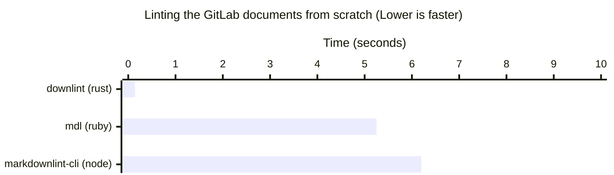

# downlint

A fast Markdown linter, written in Rust.
Compliant with [CommonMark](https://commonmark.org) and [GFM](https://github.github.com/gfm/).



## Usage

```bash
downlint check .
downlint check path/to/*.md
```

## Rules

Several [markdownlint](https://github.com/markdownlint/markdownlint) rules are currently supported.

| Rule  | Support            | Note                                         |
|-------|--------------------|----------------------------------------------|
| MD001 | :white_check_mark: |                                              |
| MD002 | :white_check_mark: |                                              |
| MD003 | :warning:          | `:atx_closed` style does not support.        |
| MD004 | :warning:          | `:sublist` style does not support.           |
| MD005 | :white_check_mark: |                                              |
| MD006 | :white_check_mark: |                                              |
| MD007 | :white_check_mark: |                                              |
| MD009 | :white_check_mark: |                                              |
| MD010 | :white_check_mark: |                                              |
| MD012 | :white_check_mark: |                                              |
| MD013 | :white_check_mark: |                                              |
| MD014 | :white_check_mark: |                                              |
| MD018 | :white_check_mark: |                                              |
| MD019 | :white_check_mark: |                                              |
| MD022 | :white_check_mark: |                                              |
| MD023 | :white_check_mark: |                                              |
| MD024 | :warning:          | `allow_different_nesting` does not support.  |
| MD025 | :white_check_mark: |                                              |
| MD026 | :white_check_mark: |                                              |
| MD027 | :warning:          | The behaviour of markdownlint is different.  |
| MD028 | :white_check_mark: |                                              |
| MD029 | :white_check_mark: |                                              |
| MD030 | :white_check_mark: |                                              |
| MD031 | :white_check_mark: |                                              |
| MD032 | :white_check_mark: |                                              |

## Development

### Testing

```bash
cargo test
```

### Linting

```bash
cargo clippy --all-targets --all-features --workspace -- -D warnings
```

### Benchark

```bash
# Download markdown dataset
./scripts/benchmarks/setup.sh

# Run downlint, mdl and markdownlint-cli with hyperfine
./scripts/benchmarks/comparison.sh
```
