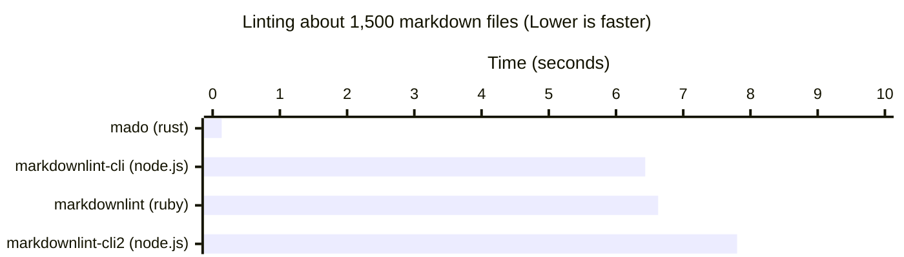

# Mado

A fast Markdown linter, written in Rust.
Compliant with [CommonMark](https://commonmark.org) and [GFM](https://github.github.com/gfm/).

## Usage

```bash
mado check .
mado check path/to/*.md
```

## Performance

48-58x faster than existing linters
(like [markdownlint](https://github.com/markdownlint/markdownlint)).



This benchmark was run on a MacBook Pro (2021, M1 Max)
using [hyperfine](https://github.com/sharkdp/hyperfine),
and [the GitLab documentation](https://gitlab.com/gitlab-org/gitlab/-/tree/7d6a4025a0346f1f50d2825c85742e5a27b39a8b/doc)
is used.

## Rules

Mado supports almost all [markdownlint rules](https://github.com/markdownlint/markdownlint/blob/main/docs/RULES.md).

* :white_check_mark: The rule is stable.
* :hammer: The rule is unstable.
* :warning: The rule has unsupported option(s).
* :x: The rule is unsupported.

| Rule  | Support            | Note                                          |
|-------|--------------------|-----------------------------------------------|
| MD001 | :white_check_mark: |                                               |
| MD002 | :white_check_mark: |                                               |
| MD003 | :hammer:           |                                               |
| MD004 | :warning:          | `:sublist` is not supported.                  |
| MD005 | :white_check_mark: |                                               |
| MD006 | :white_check_mark: |                                               |
| MD007 | :hammer:           |                                               |
| MD009 | :white_check_mark: |                                               |
| MD010 | :white_check_mark: |                                               |
| MD012 | :white_check_mark: |                                               |
| MD013 | :white_check_mark: |                                               |
| MD014 | :white_check_mark: |                                               |
| MD018 | :white_check_mark: |                                               |
| MD019 | :white_check_mark: |                                               |
| MD020 | :white_check_mark: |                                               |
| MD021 | :white_check_mark: |                                               |
| MD022 | :white_check_mark: |                                               |
| MD023 | :white_check_mark: |                                               |
| MD024 | :warning: :hammer: | `allow_different_nesting` is not supported.   |
| MD025 | :white_check_mark: |                                               |
| MD026 | :white_check_mark: |                                               |
| MD027 | :hammer:           |                                               |
| MD028 | :white_check_mark: |                                               |
| MD029 | :white_check_mark: |                                               |
| MD030 | :white_check_mark: |                                               |
| MD031 | :white_check_mark: |                                               |
| MD032 | :white_check_mark: |                                               |
| MD033 | :hammer:           |                                               |
| MD034 | :white_check_mark: |                                               |
| MD035 | :white_check_mark: |                                               |
| MD036 | :hammer:           |                                               |
| MD037 | :hammer:           |                                               |
| MD038 | :white_check_mark: |                                               |
| MD039 | :white_check_mark: |                                               |
| MD040 | :white_check_mark: |                                               |
| MD041 | :white_check_mark: |                                               |
| MD046 | :white_check_mark: |                                               |
| MD047 | :white_check_mark: |                                               |

## Configuration

Mado can be configured through a `mado.toml` or `.mado.toml` in the current directory.
In addition, the following paths are available as a global configuration file:

* `Linux`: `~/.config/mado/mado.toml`
* `macOS`: `~/.config/mado/mado.toml`
* `Windows`: `~\AppData\Roaming\mado\mado.toml`

See [the example mado.toml](https://github.com/akiomik/mado/blob/main/mado.toml)
for details.

## Github Actions

You can use Mado on Github Action.

```yaml
# Basic (Run `mado check .`)
- uses: akiomik/mado@v0.1.2

# Custom (Run `mado` with arbitrary arguments)
- uses: akiomik/mado@v0.1.2
  with:
    args: '--config path/to/mado.toml check path/to/*.md'
```

## Development

### Testing

```bash
cargo test
```

### Linting

```bash
cargo lint
```

### Benchmark

```bash
# Download markdown dataset
./scripts/benchmarks/setup.sh

# Run mado, mdl and markdownlint-cli with hyperfine
./scripts/benchmarks/comparison.sh
```

### Profiling with cargo flamegraph

Install `flamegraph` first.

```bash
cargo install flamegraph
```

Then:

```bash
# `--root` option is needed for macOS users
cargo flamegraph --root --profile bench -- check scripts/benchmarks/data/gitlab
```
